## 掘金每日自动签到，自动抽奖，自动粘喜气，自动获取挖矿游戏奖励

## fork from [KaiOrange/juejin-auto-checkin](https://github.com/KaiOrange/juejin-auto-checkin)


~~本项目使用`Github Action`来部署自动签到程序，无需自己购买服务器，安全可靠且方便。另外支持钉钉机器人通知，中了大奖第一时间便可知晓。~~

自用，原项目被ban了，改了下不再使用`Github Action`，需要自己用服务器跑脚本，相关配置文件为 [`.env`](https://github.com/Beats0/juejin-auto-checkin-serve/blob/main/.env)。


[`.env`](https://github.com/Beats0/juejin-auto-checkin-serve/blob/main/.env) 例子

```
COOKIE=MONITOR_WEB_ID=xxx; _ga=GAxxx; n_mh=xxx; passport_csrf_token_default=xxx;...
USERID=xxx
DINGTALK_WEBHOOK=https://oapi.dingtalk.com/robot/send?access_token=xxx
DINGTALK_SECRET=xxx
ALL_IN=
WX_COMPANY_ID=
WX_APP_ID=
WX_APP_SECRET=
FEISHU_WEBHOOK=
FEISHU_SECRET=
MAIL_HOST=
MAIL_SECURE=
MAIL_AUTH_USER=
MAIL_AUTH_PASS=
MAIL_TO=
TASK_TIME=0 0 2 * * *
```

<b>

注意不要上传或公开你的 `.env` 配置文件, 这可能会导致相关账户信息泄露。
</b>

### 使用方式

1. 网页登录自己的掘金账号，Cookie可以在掘金打开开发者工具，然后依次点击【Network】、【Fetch/XHR】（或者【XHR】）、【 Name】查看是否有`cookie`字段，如果没有可以换一个接口试试，找到后复制`cookie`的值，修改 `.env` 文件中的 `COOKIE` 这个字符串，Value 设置为`自己掘金的Cookie`。

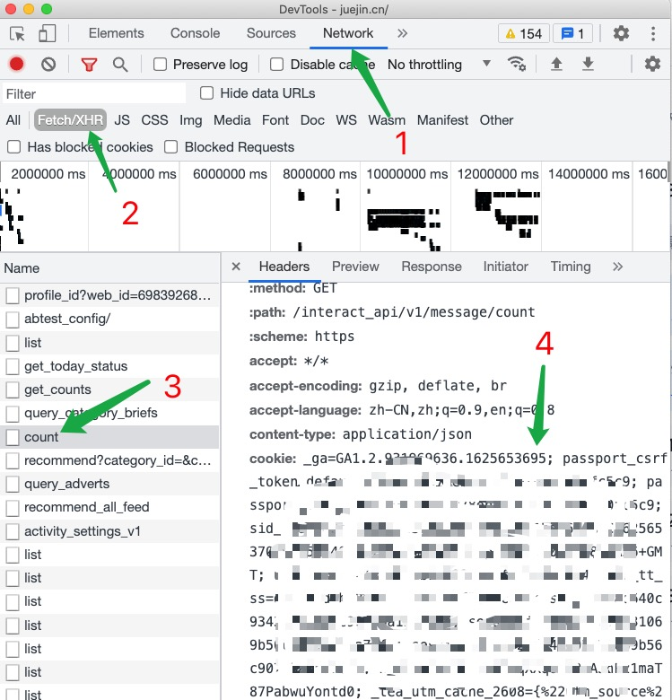

游戏 ID 获取方式:在掘金首页打开控制台输入这行代码`window.__NUXT__.state.auth.user.id`就可以得到，修改`.env` 文件中的 `USERID` 这个字符串，Value 设置为游戏 ID。

如图所示：


2. 启动脚本

#### 使用pm2管理

[pm2文档](https://github.com/Unitech/pm2#start-an-application)

```sh
$ cd
# 安装
$ npm install

# 全局安装pm2
$ npm install pm2 -g
# 运行脚本
$ npm run pm2

# To list all running applications:
$ pm2 list
# Managing apps is straightforward:
$ pm2 log      <app_name|namespace|id|'all'|json_conf>
$ pm2 stop     <app_name|namespace|id|'all'|json_conf>
$ pm2 restart  <app_name|namespace|id|'all'|json_conf>
$ pm2 delete   <app_name|namespace|id|'all'|json_conf>
```

3. 第二天查看是否已经签到成功，如果中实物奖品请尽量及时填写收货地址。

### 抽奖时间修改

修改 `.env` 文件中的 `TASK_TIME`, 以服务器时间为准, 默认 `0 0 2 * * *`, 即每天凌晨2点自动执行。

### 抽奖梭哈

修改 `.env` 文件中的 `ALL_IN`，bool类型，默认为空，即不开启抽奖梭哈， `true` 开启自动抽奖梭哈

### 接入钉钉机器人

有的时候我们需要更加实时的查看中奖信息，这个时候考虑接入钉钉机器人，具体如下：

1. 创建一个打卡群。点击钉钉右上角的加号，再点击【发起群聊】，选择一个非公司的群，如【考试群】。

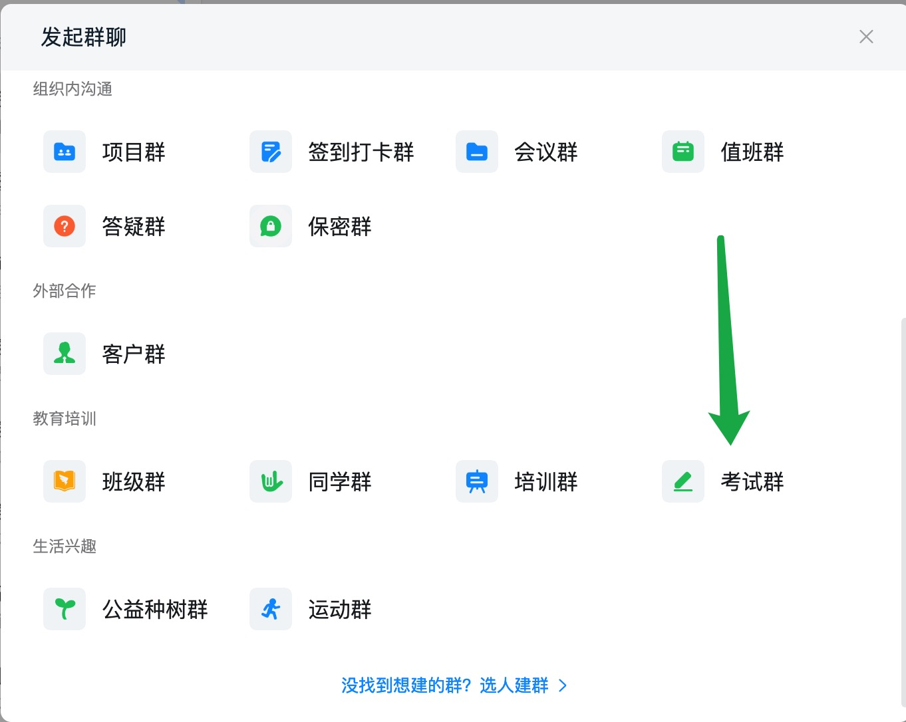

2. 输入喜欢的群名称，然后点击【创建】。

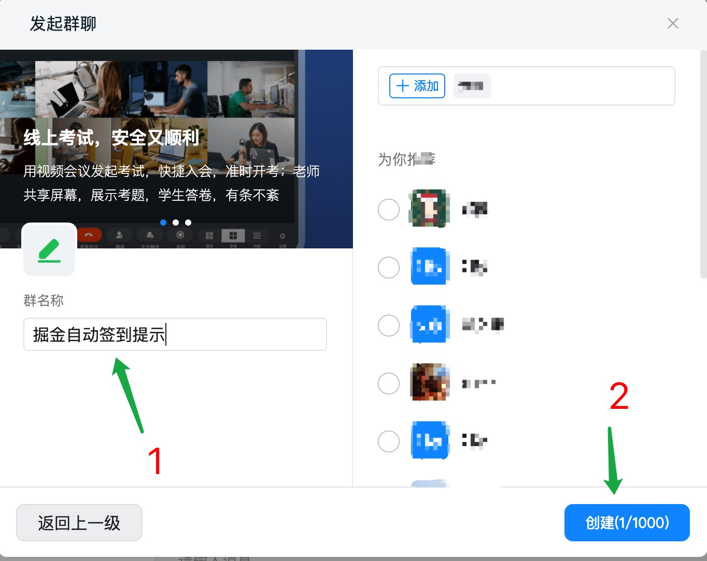

3. 在群内点击右上角设置按钮，然后依次点【智能群助手】、【添加机器人】、【自定义】、【添加】。

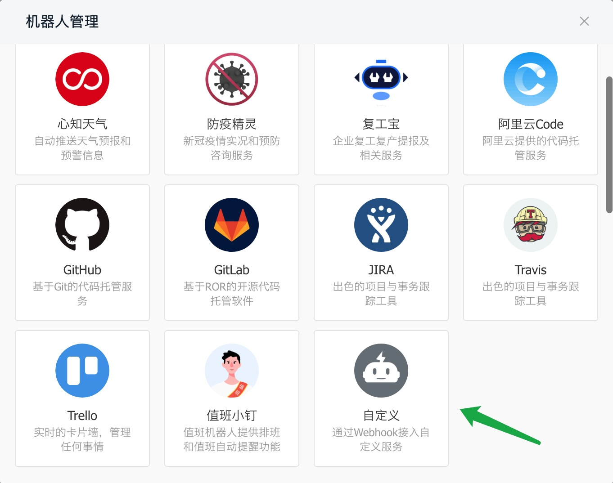

4. 给机器人起一个名字，然后点【加签】，并复制秘钥的内容（秘钥有点长，要复制输入框内的所有内容）。

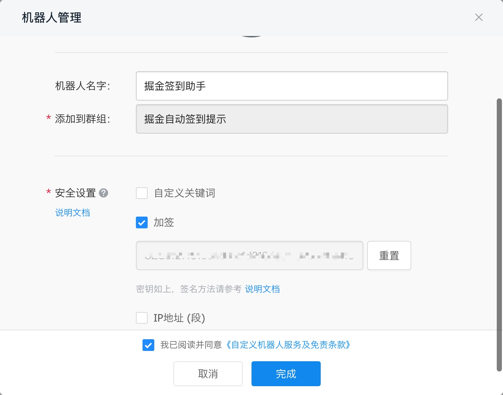

5. 修改 `.env` 文件中的 `DINGTALK_SECRET`，Value 是刚才复制的内容（操作过程可以参考上面【使用方式】第 2、3 步）。


6. 完成后复制`Webhook`的内容。

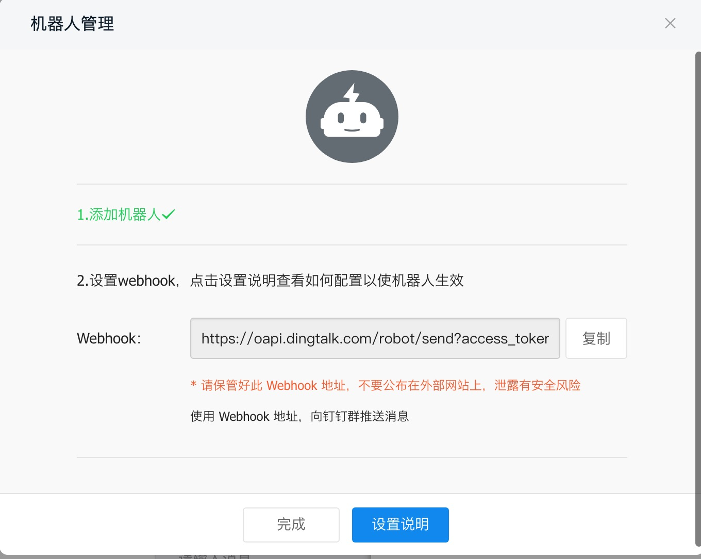

7. 修改 `.env` 文件中的 `DINGTALK_WEBHOOK`，Value 是刚才复制的内容。


8. 返回钉钉完成即可，由于我们是凌晨签到的，如果害怕大半夜推送打扰到自己，可以把群设置成消息免打扰。

### 接入微信通知

微信通知依赖于企业微信，通过企业微信向微信推送消息

#### 第一步，注册企业

用电脑打开[企业微信官网](https://work.weixin.qq.com/)，注册一个企业。**有手机号就可以注册，不用营业执照！不用营业执照！不用营业执照！**

#### 第二步，创建应用

注册成功后，点「管理企业」进入管理界面，选择「应用管理」 → 「自建」 → 「创建应用」


应用名称随意填，可见范围选择公司名。


创建完成后进入应用详情页，可以得到应用 ID( `agentid` )①，应用 Secret( `secret` )②。


#### 第三步，获取企业 ID

进入「[我的企业](https://work.weixin.qq.com/wework_admin/frame#profile)」页面，拉到最下边，可以得到企业 ID③。

#### 第四步，推送消息到微信

进入「我的企业」 → 「[微信插件](https://work.weixin.qq.com/wework_admin/frame#profile/wxPlugin)」，拉到下边扫描二维码，关注以后即可收到推送的消息。


PS：如果出现`接口请求正常，企业微信接受消息正常，个人微信无法收到消息`的情况：

1. 进入「我的企业」 → 「[微信插件](https://work.weixin.qq.com/wework_admin/frame#profile/wxPlugin)」，拉到最下方，勾选 “允许成员在微信插件中接收和回复聊天消息” 

2. 在企业微信客户端 「我」 → 「设置」 → 「新消息通知」中关闭 “仅在企业微信中接受消息” 限制条件 

#### 第五步，修改变量


1. 修改 `.env` 文件中的 `WX_APP_ID`，Value 是第二步的 AgentId。

2. 修改 `.env` 文件中的 `WX_APP_SECRET`，Value 是第二步 Secret。

3. 修改 `.env` 文件中的 `WX_COMPANY_ID`，Value 是第三步的 企业 ID。

### 接入飞书机器人

飞书机器人通知依赖于飞书，通过飞书向指定群组推送消息，具体操作如下:

1. 打开飞书，聊天列表顶部加号`创建群组`,群名称任意，点击创建 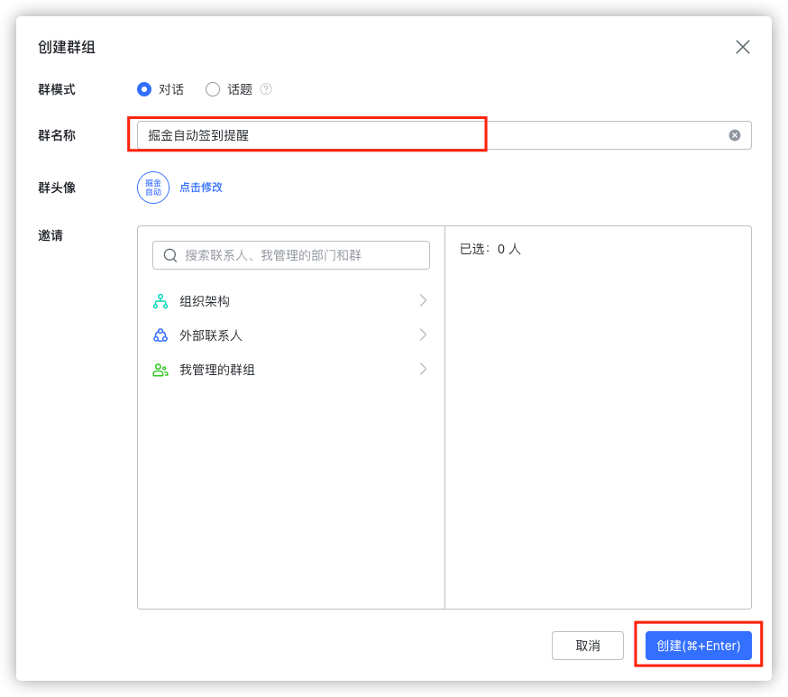

2. 进入群组，点击群组设置按钮添加机器人 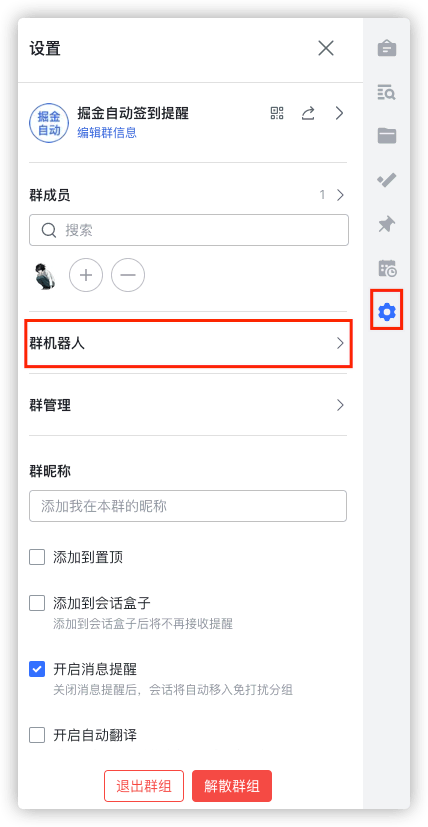

3. 选择自定义机器人 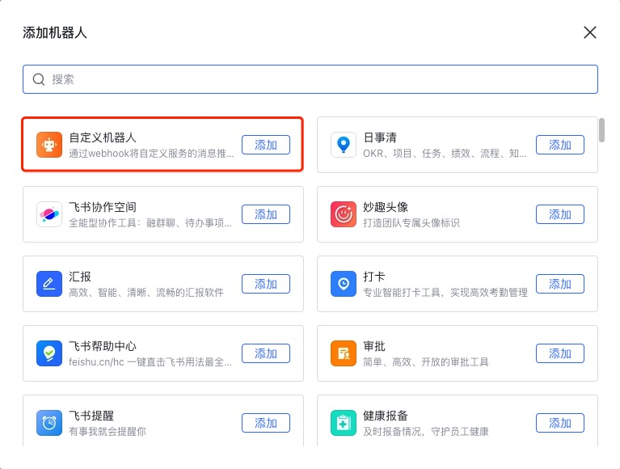

4. 机器人名称和描述随意填写,点击下一步 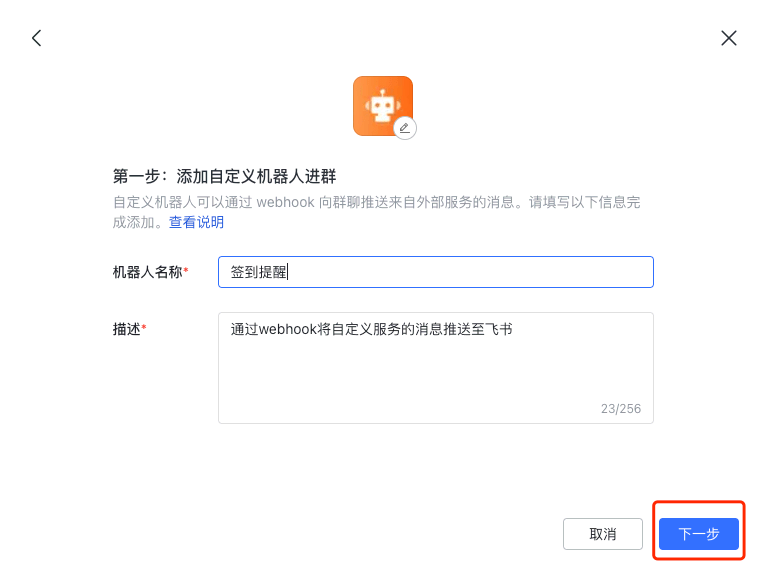

5. 在`安全设置`中勾选`签名校验`,复制下 webhook 地址和签名校验内容，修改 `.env` 文件中的 `FEISHU_WEBHOOK`，Value 填写 webhook 地址, 修改 `.env` 文件中的 `FEISHU_SECRET`，Value 填写的签名校验内容 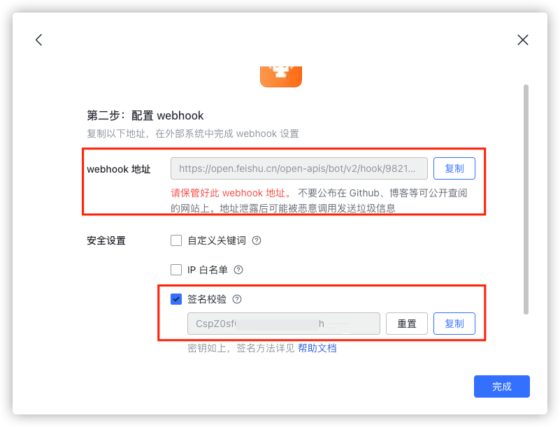

### 接入邮箱

修改 `.env` 文件

```
...

MAIL_HOST=smtp.163.com          // 邮箱服务的主机，如smtp.163.com、smtp.qq.com
MAIL_SECURE=true                // 开启安全连接，bool 类型, 默认true
MAIL_AUTH_USER=example@163.com  // 发送方邮箱地址
MAIL_AUTH_PASS=pass             // 这里是授权密码而不是邮件密码,163邮箱默认密码即授权码
MAIL_TO=example@163.com         // 接收方邮箱地址，可以为相同邮箱

...
```

### 测试脚本

配置 `test` 文件夹下的参数运行即可

```sh
$ npm run test:api              # 接口测试
$ npm run test:dingtalk         # 钉钉推送测试
$ npm run test:feishu           # 飞书推送测试
$ npm run test:mail             # 邮箱推送测试
$ npm run test:wx               # 微信推送测试
$ npm run test:game             # 游戏测试
``` 
